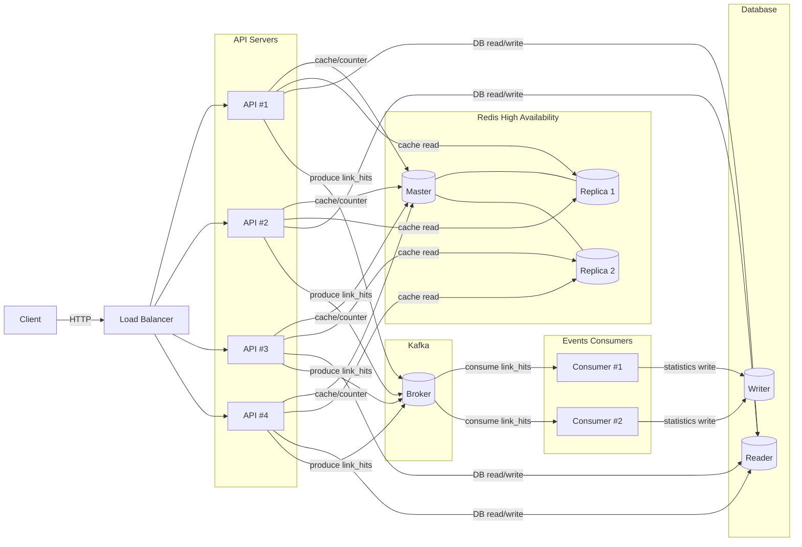

# ShortLink Backend

URL 단축 서비스 백엔드. 헥사고날 아키텍처를 기반으로 API 서버와 Kafka 기반 이벤트 컨슈머로 구성됩니다.

## 시스템 아키텍처

### 헥사고날 아키텍처 (Ports and Adapters)
- 비즈니스 로직과 구현 세부(웹, DB, 캐시, 스트림)를 포트로 분리합니다.
- 테스트 용이성, 기술 교체 용이성, 모듈 간 결합도 감소를 목표로 합니다.

## 📁 패키지 구조

```
api-server/
  src/main/java/io/github/columnwise/shortlink/
    domain/                 # 도메인 모델과 규칙
    application/
      port/
        in/                 # 유스케이스 입력 포트
        out/                # 외부 시스템 출력 포트 (Cache, Repository, Stream)
      service/              # 유스케이스 구현
    adapter/
      web/                  # REST API
      persistence/          # JPA 어댑터
      cache/                # Redis 캐시/카운터
      id/                   # ID 생성기
      stream/               # Kafka 프로듀서
    config/
    util/

events-consumer/
  src/main/java/io/columnwise/shortlink/eventsconsumer/
    domain/
      event/                # 이벤트 도메인
    application/
      port/
        in/                 # ProcessVisitEventUseCase 등
        out/                # OlapWriterPort 등
      service/              # 컨슈머 유스케이스 구현
    adapter/
      inbound/kafka/        # Kafka 컨슈머
      outbound/olap/        # ClickHouse 등 OLAP 적재
```

### 계층 설명
- Domain: 핵심 규칙과 모델, 기술 비의존 순수 객체
- Application: 유스케이스, 입력/출력 포트, 서비스 오케스트레이션
- Adapters: Web, Persistence, Cache, Stream 등 구현체

## 시스템 다이어그램


```mermaid
flowchart LR
  Client[Client]
  LB[Load Balancer]

  subgraph App[API Servers]
    A1[API #1]
    A2[API #2]
    A3[API #3]
    A4[API #4]
  end

  subgraph Kafka[Kafka]
    K[(Broker)]
  end

  subgraph Consumers[Events Consumers]
    EC1[Consumer #1]
    EC2[Consumer #2]
  end

  subgraph Redis[Redis High Availability]
    RM[(Master)]
    RR1[(Replica 1)]
    RR2[(Replica 2)]
    RM --- RR1
    RM --- RR2
  end

  subgraph DB[Database]
    DBW[(Writer)]
    DBR[(Reader)]
  end

  Client -->|HTTP| LB
  LB --> A1
  LB --> A2
  LB --> A3
  LB --> A4

  A1 -->|cache/counter| RM
  A2 -->|cache/counter| RM
  A3 -->|cache/counter| RM
  A4 -->|cache/counter| RM

  A1 -->|cache read| RR1
  A2 -->|cache read| RR1
  A3 -->|cache read| RR2
  A4 -->|cache read| RR2

  A1 -->|DB read/write| DBR
  A2 -->|DB read/write| DBR
  A3 -->|DB read/write| DBR
  A4 -->|DB read/write| DBR

  A1 -->|produce link_hits| K
  A2 -->|produce link_hits| K
  A3 -->|produce link_hits| K
  A4 -->|produce link_hits| K

  K -->|consume link_hits| EC1
  K -->|consume link_hits| EC2

  EC1 -->|statistics write| DBW
  EC2 -->|statistics write| DBW
```

설명: API 서버는 방문 이벤트를 Kafka `link_hits` 토픽에 발행하고, Events Consumer는 이를 구독하여 통계/로그성 데이터를 DB로 적재합니다. Redis는 캐시와 카운터로 사용합니다. 로컬 개발은 단일 인스턴스로 실행할 수 있으나, 목표 아키텍처는 다중 인스턴스 기반의 분산/고가용성 환경입니다.

## 핵심 기능

- Redis 고가용성 구조 고려 (Master + Replicas)
- 이벤트 기반 비동기 처리: Kafka 생산/소비를 통한 트래픽 디커플링
- 조회 카운터: Redis 원자적 증가 연산으로 수집
- 다양한 ID 생성 전략: Base62, Snowflake, Hash 기반

## 성능 최적화

- TTL 기반 캐시 만료 정책
- Lua 스크립트 기반 원자적 카운터/증감 연산
- 비동기 파이프라인으로 API 응답 지연 최소화

## 사용 기술

- Java 21 + Spring Boot 3.x
- Spring Data JPA + MySQL
- Redis (Cache, Counter)
- Kafka + Spring for Apache Kafka
- Gradle + JUnit 5

## 테스트

- 단위/통합 테스트: JUnit 5
- 모듈별 테스트 구성, 필요 시 테스트용 프로필 분리
- Redis/Kafka 통합 시 상태 격리 및 만료/경합 엣지케이스 우선

## 로컬 개발

```bash
# 전체 빌드 및 테스트
./gradlew clean build

# API 서버 실행
./gradlew :api-server:bootRun

# Events Consumer (개발 프로필) 실행 예시
./gradlew :events-consumer:run --args='--spring.profiles.active=dev'
```

