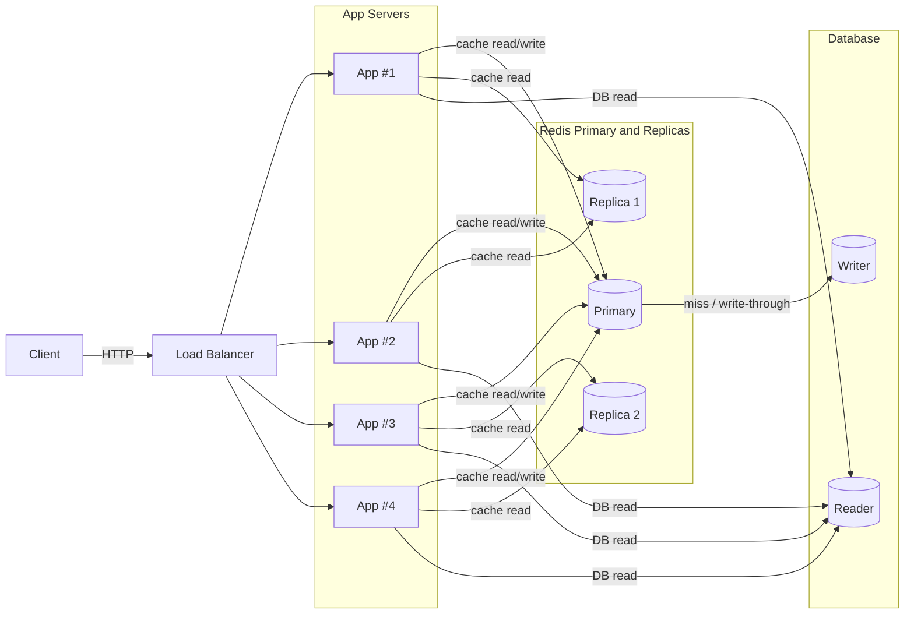

# ShortLink Backend

분산 환경을 고려한 URL 단축 서비스 백엔드

## 🏗️ 아키텍처

### 헥사고날 아키텍처 (Ports and Adapters)

이 프로젝트는 헥사고날 아키텍처를 채택하여 비즈니스 로직과 외부 시스템 간의 결합도를 낮추고 테스트 가능성을 높였습니다.

#### 선택 이유
- **테스트 용이성**: 외부 의존성을 Mock으로 쉽게 대체 가능
- **기술 교체 유연성**: 데이터베이스나 캐시 시스템 교체 시 비즈니스 로직 변경 불필요
- **의존성 역전**: 비즈니스 로직이 인프라스트럭처에 의존하지 않음
- **분산 환경 대응**: 각 어댑터를 독립적으로 확장 및 배포 가능

## 📁 패키지 구조

```
io.github.columnwise.shortlink/
├── 📁 domain/                    # 도메인 계층
│   ├── model/                   # 도메인 모델 (ShortUrl, UrlAccessLog)
│   ├── service/                 # 도메인 서비스
│   └── exception/               # 도메인 예외
│
├── 📁 application/               # 애플리케이션 계층
│   ├── port/
│   │   ├── in/                  # 인바운드 포트 (Use Cases)
│   │   │   ├── CreateShortUrlUseCase
│   │   │   ├── ResolveUrlUseCase
│   │   │   └── GetStatsUseCase
│   │   └── out/                 # 아웃바운드 포트
│   │       ├── CachePort
│   │       ├── DistributedLockPort
│   │       ├── UrlHitCounterPort
│   │       └── ShortUrlRepositoryPort
│   └── service/                 # 애플리케이션 서비스 (Use Case 구현)
│
├── 📁 adapter/                   # 어댑터 계층
│   ├── web/                     # 웹 어댑터 (REST API)
│   │   ├── ShortUrlController
│   │   ├── dto/                 # 요청/응답 DTO
│   │   └── GlobalExceptionHandler
│   ├── persistence/             # 영속성 어댑터
│   │   ├── entity/              # JPA 엔티티
│   │   ├── ShortUrlRepositoryAdapter
│   │   └── SpringData*Repository
│   ├── cache/                   # 캐시 어댑터 (Redis)
│   │   ├── RedisCacheAdapter
│   │   └── RedisHitCounterAdapter
│   ├── lock/                    # 분산 락 어댑터
│   │   └── RedisLockAdapter
│   └── id/                      # ID 생성 어댑터
│       ├── Base62CodeGenerator
│       ├── SnowflakeCodeGenerator
│       └── HashPrefixRehashCodeGenerator
│
├── 📁 config/                    # 설정
│   └── RedisProperties
│
├── 📁 batch/                     # 배치 작업
│
└── 📁 util/                      # 유틸리티
```

### 계층별 역할

#### 🎯 Domain (도메인)
- 비즈니스 핵심 로직과 규칙
- 외부 기술에 의존하지 않는 순수 Java 객체
- `ShortUrl`, `UrlAccessLog` 등 핵심 엔티티

#### 🔄 Application (애플리케이션)  
- **Inbound Ports**: 외부에서 들어오는 요청 인터페이스 (Use Cases)
- **Outbound Ports**: 외부 시스템 호출 인터페이스  
- **Services**: 비즈니스 로직 조합 및 트랜잭션 관리

#### 🔌 Adapters (어댑터)
- **Web**: REST API 엔드포인트
- **Persistence**: 데이터베이스 연동 (JPA)
- **Cache**: Redis 캐싱  
- **Lock**: Redis 분산 락
- **ID**: 단축 코드 생성 알고리즘

## 🗂️ 시스템 아키텍처


## 🚀 주요 기능

### 분산 환경 지원
- **Redis 캐싱**: 인기 URL 빠른 응답
- **분산 락**: 동시 요청 충돌 방지  
- **조회수 카운터**: 원자적 증감 연산
- **다중 ID 생성 전략**: Base62, Snowflake, Hash-based

### 성능 최적화
- TTL 기반 캐시 만료 관리
- Lua 스크립트 기반 원자적 Redis 연산
- ThreadLocal 기반 분산 락 토큰 관리

## 🛠️ 기술 스택

- **Java 21** + **Spring Boot 3.x**
- **Spring Data JPA** + **H2/MySQL**  
- **Redis** (Cache, Counter, Distributed Lock)
- **Gradle** + **JUnit 5**

## 🧪 테스트

### 실행 방법
```bash
# 모든 테스트 실행
./gradlew test

# 특정 테스트 클래스 실행
./gradlew test --tests "*RedisAdapterTest"
```

### 테스트 구성
- **단위 테스트**: 각 계층별 독립적 테스트
- **통합 테스트**: Spring Context를 이용한 전체 플로우 테스트
- **Redis 어댑터 테스트**: Mock Redis를 이용한 캐시/락/카운터 테스트

## 🔧 개발 환경 설정

### 요구사항
- Java 21+
- Redis (로컬 개발 시)

### 실행
```bash
# 애플리케이션 실행
./gradlew bootRun

# 프로파일별 실행
./gradlew bootRun --args='--spring.profiles.active=local'
```

## 📈 확장 계획

### 애플리케이션 서버

- 현재 4대 구성 → 트래픽 증가 시 무중단 배포/오토스케일링 지원
- 로드밸런서(ALB/Nginx) 앞단 배치로 트래픽 분산
- 헬스체크 기반 자동 교체

### Redis

- 캐시 전용 Redis는 프라이머리–리플리카 구조로 고가용성 확보
- 초기에는 단일 샤드(프라이머리 1, 리플리카 2)
- 트래픽이 커지면 Redis Cluster 샤딩으로 수평 확장
- 분산락 필요 시에는 작은 전용 Redis 인스턴스 추가 (캐시와 분리)

### DB

- 쓰기 1대 / 읽기 1대 → 초반에는 충분
- 조회 비중이 크므로 리드 레플리카를 다수 두어 읽기 부하 분산
- 파티셔닝 or 샤딩은 트래픽이 폭발적으로 증가할 때 고려
- 배치 / 통계 처리
- 조회 로그(UrlAccessLog)는 DB에 축적
- 장기적으로 Kafka 같은 로그 스트리밍 + Spark/Flink 기반 집계 파이프라인 확장 가능

### 모니터링/운영

- Prometheus + Grafana로 서버/Redis/DB 메트릭 수집
- 장애 시 자동 페일오버(Sentinel 또는 관리형 서비스) 활용
